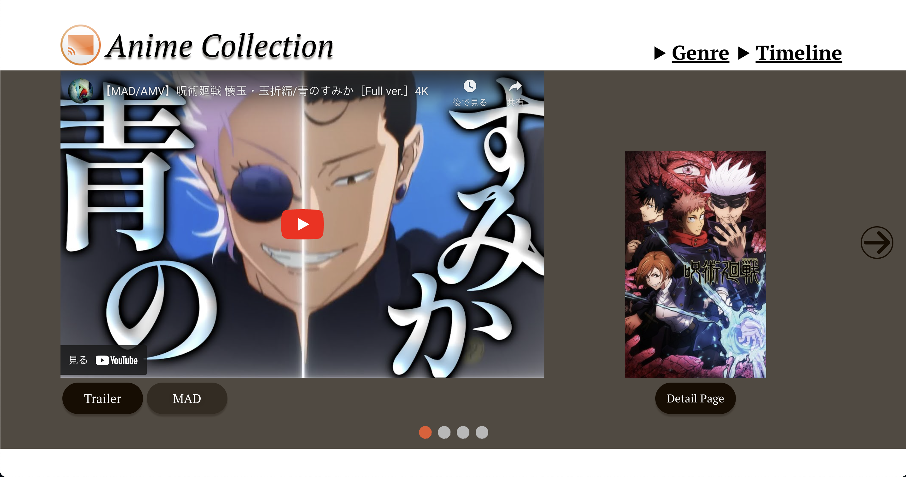
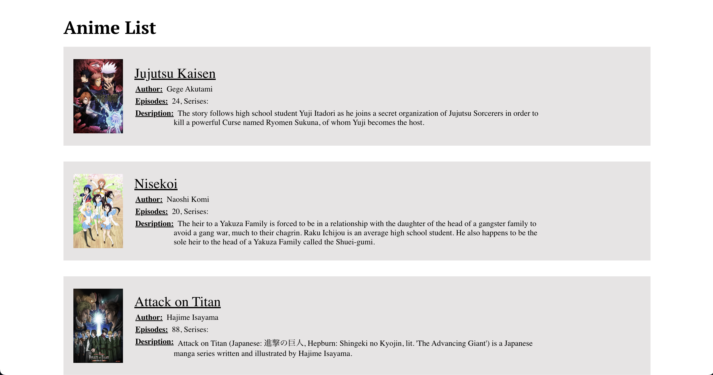
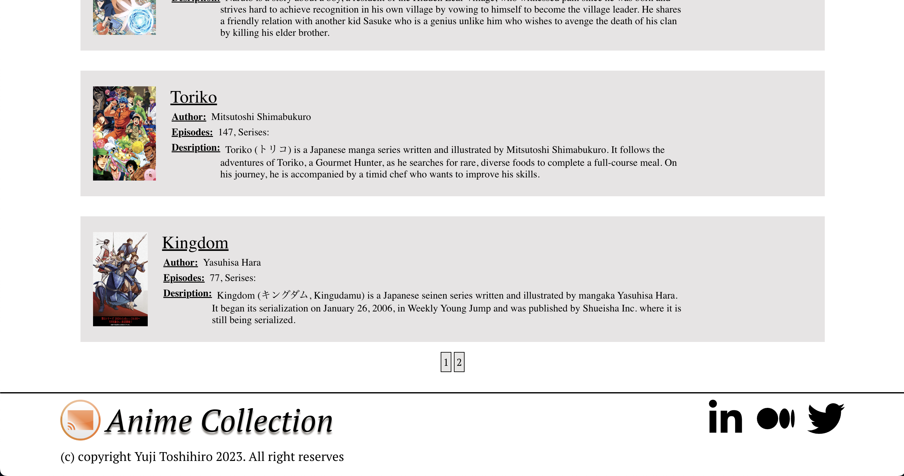
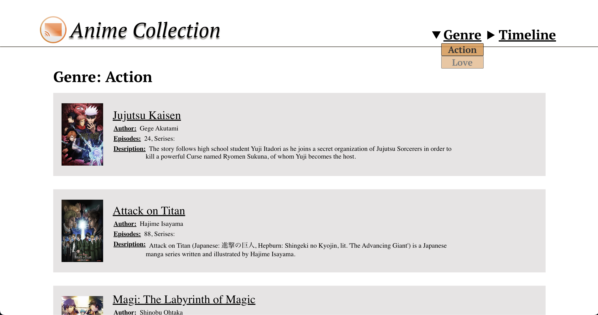
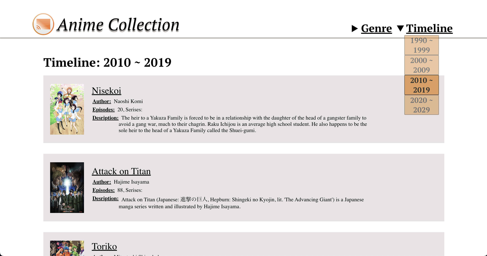
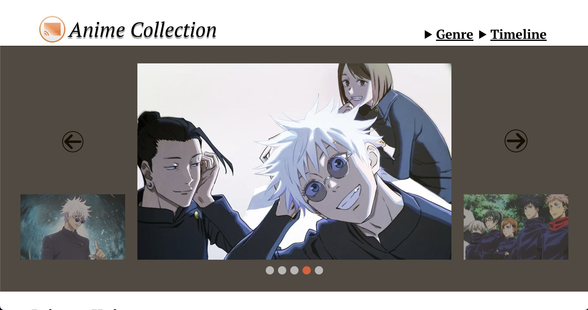
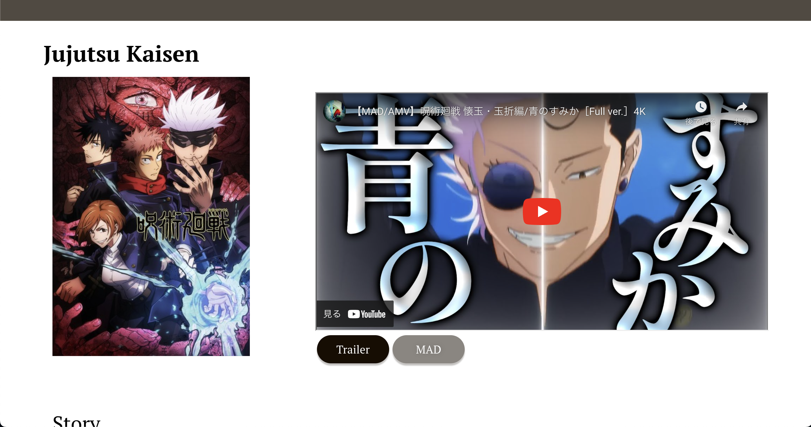
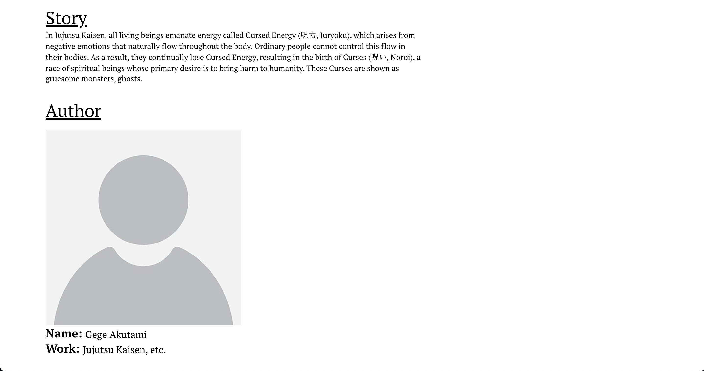
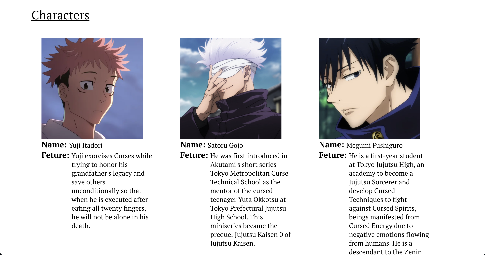

   
  
   
   
  

 

 

## • Overview

This is an anime collection website. You can see some popular anime's information. This includes trailer, MAD, author, and characters one. This website is hosted [here](https://anime-collection-fullstack.vercel.app/) using vercel.

API directory is [here](https://github.com/honganji/anime-collection-api).

## • Tech Stack
### Design
- Figma
### Frontend
- Javascript(React)
- FontAwesome
- Vercel
### Backend
- Java(Spring)
- Google Cloud(API)
- MySQL
- Aiven(DB)

## • Frontend images
### Home

### Genre

### Detail

## • Launch

1. run `npm install` in terminal.

2. Run `npm start` in terminal.
