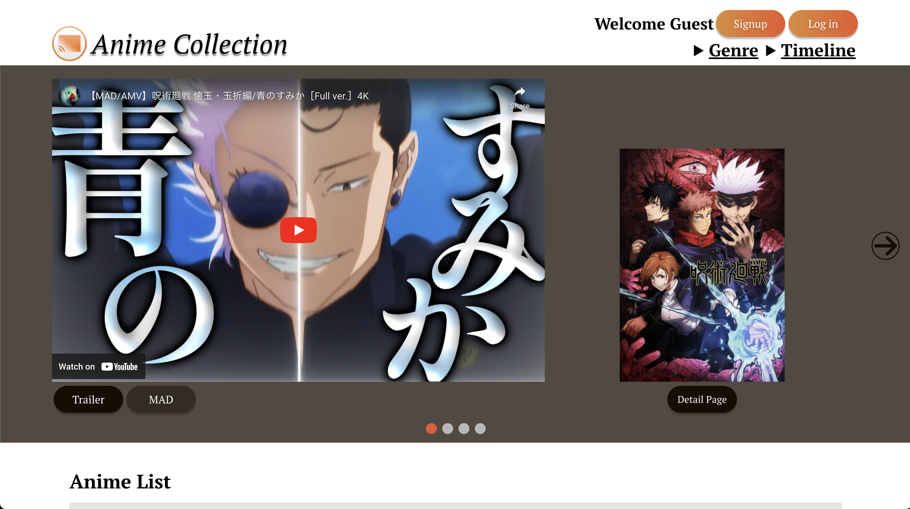
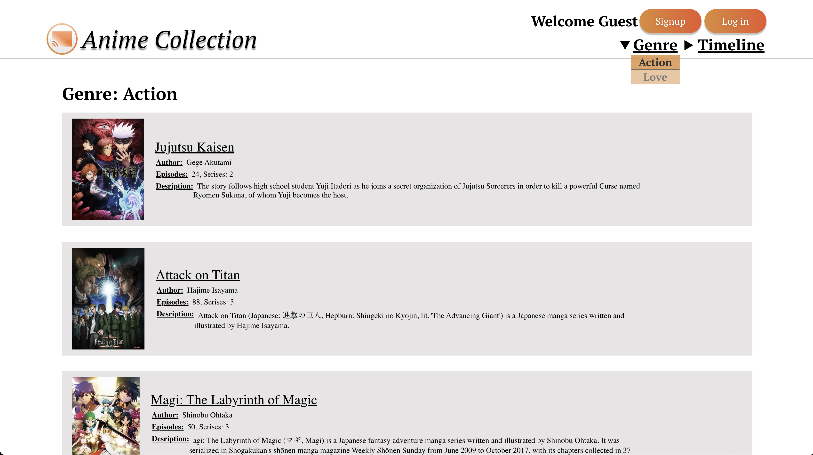
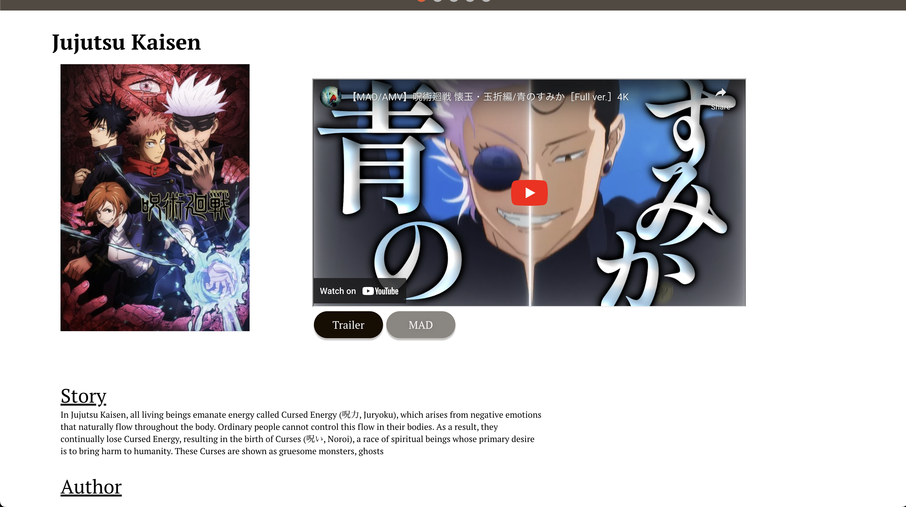
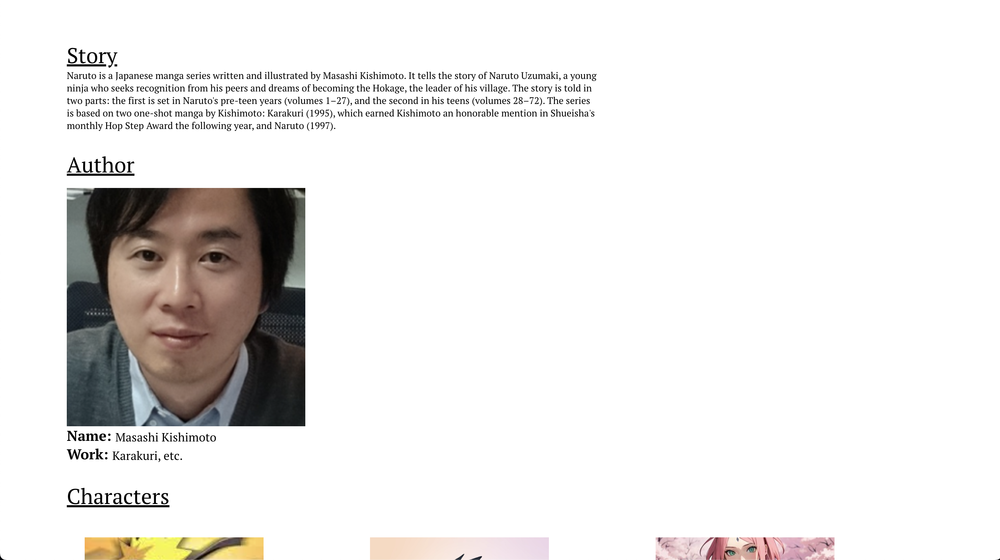
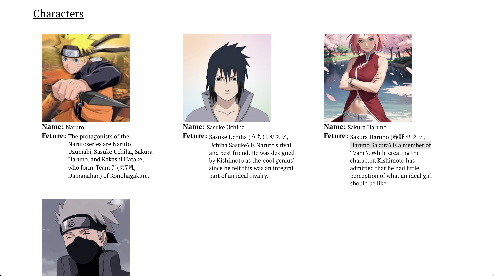

   
  
   
   
  

 

 

## • Overview

This is an anime collection website. You can see some popular anime's information. This includes trailer, MAD, author, and characters one. This website is hosted [here](https://app.unchain.tech/learn/NEAR-MulPay/) using vercel.

## • Frontend images
### Home

### Genre

### Detail

## • Launch

1. run `npm install` in terminal.

2. Run `npm start` in terminal.
